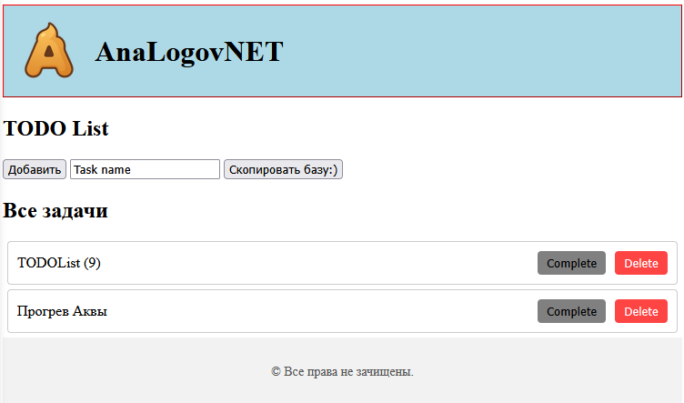
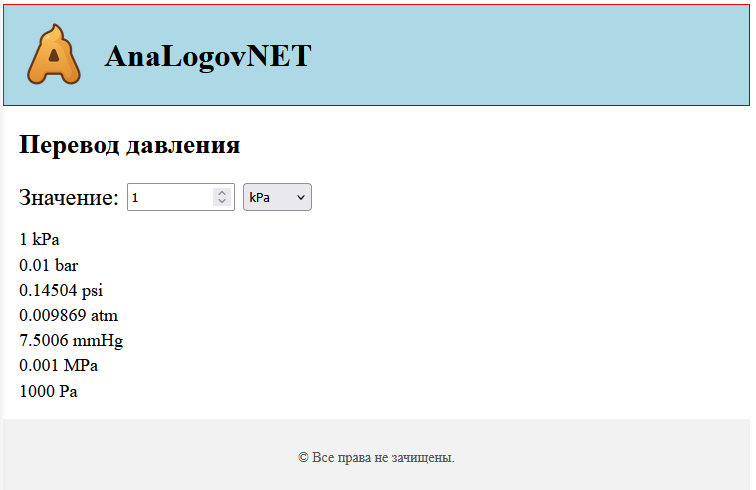

# OfflineApp2

* Вероятность того что это приложение не будет использоваться наивысшая.




## Зачем

* Посмотреть как там html css js поживают (автор не является разработчиком вэб-приложений)
* Выполнение повседневных задач(расчет, конверация, прочее(уже и забыл, добавить todo-list))
* Кроссплатформенность: ну полная, никаких нативных приложений
* Не использовать фреймворки, чтобы разобраться(на текущий момент)

Приложение написано с использованием всех доступных средств, включаа ИИ(в частности ChatGPT точно).

## Установка :)

~~Скопировать приложение и запустить в браузере index.html~~(не работает на телефоне)

### Варианты

1. Собрать все в 1 большой html

    ```console
    npm install -g inliner
    inliner index.html > release/OfflineApp2.html
    ```

    Скопировать /release/OfflineApp2.html и запустить

2. Запустить index.html через totalCommander(использует встроенный файловый менеджер у браузера есть доступ, +- в этом направлении)
3. Запустить http server на телефоне (работает с использованием Simple HTTP Server, не удобно запускать(открыть приложение, запустить сервер, нажать на адрес и открыть))
4. TODO Найти оптимальный способ

## TODOList
### v0.0 (init) 2025.10.16
1. Хранение базы в localStorage
2. Формат задачи:
    * Генерируемый уникальный идентификатор
    * Имя 
    * Подзадачи (список задач, которые могут включать задачи - глубина не ограничена)
3. Управление:
    * Панель навигации. Отображение пути задач до текущей с возможностью выбора новой текущей.
    * Отображение задач текущей задачи (имя)
    * Удаление задач текущей задачи
    * Отметить выполнение/убрать отметку выполнения задач текущей задачи
    * Добавлени задачи в список задач текущей задачи
4. Копирование текущей базы в буфер обмена.

